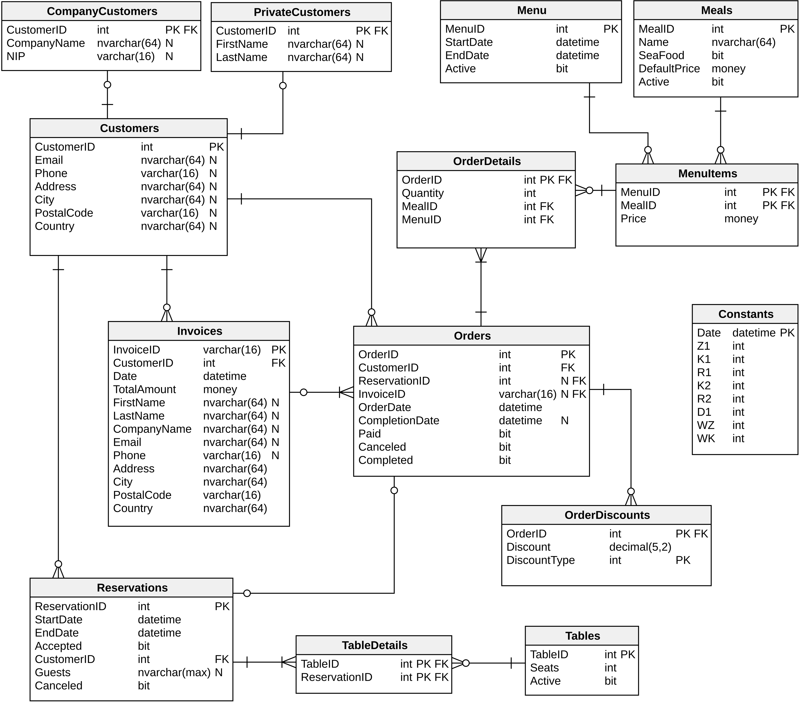

# Restaurant Database
The database system was created as a final project during the Basics of Databases course at AGH UST. We started from defining the database functionality, then we developed a logical data model and finally - implemented it using TSQL. The database was hosted on AGH's server. 

## Functionality

The database supports the workings of a company that provides catering services for both individual and corporate customers. The system stores and processes data concerning the following apsects of the business:
* **Customers** - the records of the customers who use the company's services. Their personal data is stored.
* **Menus** - the dadabase stores information about offered meals and prices. Menus can be different in various periods of time.
* **Orders** - the system processes all the orders handled by the company. Discounts are given automatically according to the preset rules.
* **Reservations** - the database controls table reservations in the restaurant and ensures no reservations overlapping.
* **Invoices** - the system allows to issue singular and collective invoices on the basis of completed orders.
* **Reports** - the systems enables automatic generation of reports on various areas of the current activity of the company.

The full description of the database functionality and the implementation details are available in the [documentation](dokumentacja.pdf) (in Polish).

## Model

## License
This project is under MIT [license](LICENSE).
